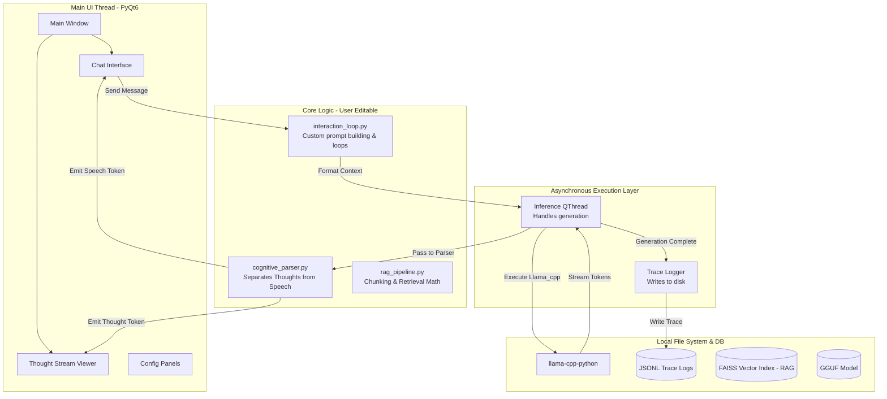

# Karl — System Architecture and Data Flow

## 1. High-Level Component Diagram

## 2. In-Depth Component Interactions

### 2.1 The Introspection & Parsing Pipeline
To allow the user to "see how it thinks", we introduce `cognitive_parser.py` into the hackable core.
When tokens stream from the engine, they pass through this script. The script maintains a state machine:
- **State A (Thinking):** Tokens are yielded to the "Thought Stream Viewer" signal.
- **State B (Speaking):** Tokens are yielded to the "Chat Interface" signal.
The user can modify this parser to catch different types of reasoning blocks (e.g., `<reflection>`, `<thought>`, or JSON-based thought objects).

### 2.2 Trace Logging
Every execution triggers the Trace Logger. The Logger guarantees that nothing is lost. Even if the UI crashes, the exact prompt, the exact parameters, and the exact response are saved to a file on disk, providing an immutable audit trail of the model's cognitive process.

### 2.3 Universal RAG Pipeline
The `rag_pipeline.py` utilizes `sentence-transformers` to generate embeddings and stores them in a local `faiss-cpu` index. It uses format-specific extractors (`PyMuPDF` for `.pdf`, `python-docx` for `.docx`, etc.) to allow the user to inject virtually any file type into the model's knowledge base. Retrieved chunks are automatically pre-pended to the `System Prompt` before hitting the `interaction_loop`.
