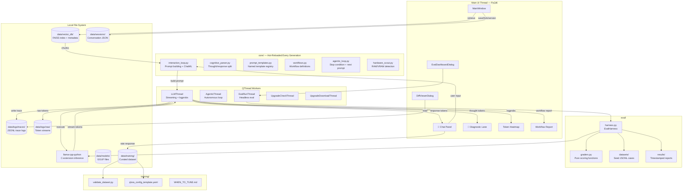

# Karl — System Architecture and Data Flow (v2)

## 1. High-Level Component Diagram



---

## 2. Component Details

### 2.1 Hackable Core (`core/`)

All files in `core/` are loaded via `importlib.reload()` on every generation. The user can open any file, save it, and click Generate — the change takes effect immediately without restarting the application.

| File | Responsibility |
|---|---|
| `interaction_loop.py` | Builds the final prompt string from system prompt + history. Controls ChatML formatting. |
| `cognitive_parser.py` | Stateful parser that splits `<think>...</think>` from the final response. |
| `prompt_templates.py` | Registry of named system prompt templates with `{placeholder}` filling. |
| `workflows.py` | Maps workflow names to template, RAG config, output schema, and eval grader. |
| `agentic_loop.py` | Defines stop condition and next-prompt injection for autonomous iteration. |
| `hardware_scout.py` | Reads system RAM and VRAM to determine which model tier to recommend. |

### 2.2 LLMThread

The core worker thread. Responsibilities:
1. Reload `core/interaction_loop.py` via `importlib`
2. Trim history to fit the context budget (sliding window, per-message char cap)
3. Call `llm()` with streaming, `logprobs=5`, and `logit_bias` if set
4. Route streaming tokens: `<think>` content → `new_thought_token`; other content → `new_chat_token`; everything → `new_raw_token`
5. Collect `(token, top_logprob)` pairs and emit `token_logprobs_ready` on completion
6. Detect `finish_reason == "length"` (truncation) and emit `generation_finished(truncated=True)` so `MainWindow` can auto-continue
7. Write the full trace entry to `data/logs/traces/`

### 2.3 RAG Pipeline (`app/utils/rag_pipeline.py`)

```
ingest_file()
  └── extract text (fitz / docx / plain)
      └── chunk (512 tokens, 64 overlap)
          └── encode (sentence-transformers)
              └── add to FAISS index
                  └── save index + metadata JSON

retrieve(query, top_k)
  └── encode query
      └── FAISS search
          └── fetch metadata
              └── optionally prepend [Source: file | Chunk N] header
                  └── return list[str]
```

The FAISS index and metadata are persisted to `data/vector_db/` and reloaded on startup. The index survives restarts and accumulates across sessions.

### 2.4 Eval Harness (`eval/`)

```
EvalHarness.run(dataset_path, workflow_name)
  └── load JSONL cases
      └── for each case:
          ├── resolve context (RAG → context_file → inline)
          ├── build system prompt via get_template()
          ├── call ModelLoader (same singleton as UI)
          ├── strip <think> blocks from output
          └── run grader → {passed, score, detail}
  └── aggregate → EvalReport
      └── save to eval/results/WORKFLOW_TIMESTAMP.jsonl
```

Graders are pure functions — no side effects, no model calls. They can be tested independently of the harness.

### 2.5 Training Data Flow

```
UI generation
  └── user clicks 👍 → save_example(source="thumbs_up")
  └── user clicks 👎 → correction dialog
      └── save_example(source="corrected", rejected_response=original)

data/training/curated.jsonl
  └── validate_dataset.py → schema / count / balance / token length / duplicates
  └── export_unsloth() → SFT JSONL (ShareGPT format)
  └── export_dpo()     → DPO JSONL (TRL DPOTrainer format)

External training (Unsloth / TRL):
  └── training/qlora_config_template.yaml
  └── merge adapter → GGUF
  └── drop into data/models/ → reload in Karl
```

### 2.6 Session Branching

```
data/sessions/
  session_20250115_103045.json          ← base session
  session_20250115_103045_fork_20250115_142200.json   ← fork point A
  session_20250115_103045_v_v2-with-rag.json          ← named version
```

`fork_session()` copies the full history up to the fork point. The user continues on the fork without touching the original. `save_version()` snapshots the current state with a human-readable tag.

---

## 3. Privacy Architecture

```
main.py (first lines, before any import)
  └── os.environ["HF_HUB_OFFLINE"]            = "1"
  └── os.environ["HF_HUB_DISABLE_TELEMETRY"] = "1"
  └── os.environ["HF_DATASETS_OFFLINE"]       = "1"
  └── os.environ["TOKENIZERS_PARALLELISM"]    = "false"

llama-cpp-python:  C-extension, runs in-process, no network
sentence-transformers: model cached locally, HF_HUB_OFFLINE blocks all checks
FAISS: pure local math, no network
```

No localhost ports. No background daemons. No telemetry. All data stays in `data/`.
